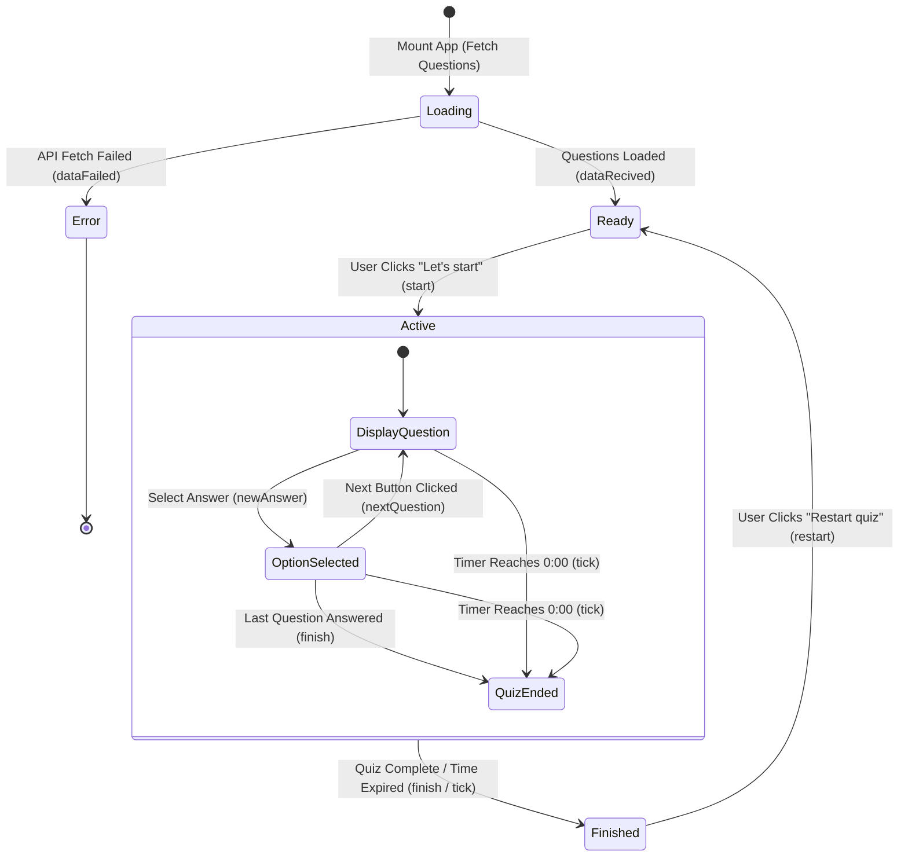

# ⚛️ The React Quiz

## 📖 Overview

**The React Quiz** is a web application designed to test developers' mastery of core React concepts. Built to showcase modern React development patterns, it replaces fragmented `useState` calls with a centralized, predictable state machine powered by the **`useReducer`** hook.

The application fetches questions asynchronously from a mock REST API backend (`json-server`), tracks live progress and scores, enforces per-quiz countdown timers, and retains session highscores across retries.

---

## ✨ Key Features

- ⚡ **Centralized State Machine**: Complete application lifecycle (`loading`, `error`, `ready`, `active`, `finished`) managed cleanly through React's `useReducer`.
- 🌐 **Async REST API Integration**: Dynamic question loading from a local `json-server` backend with loading spinners and robust error boundary UI.
- ⏱️ **Real-Time Countdown Timer**: Dynamically calculated time limit (30 seconds per question) with automatic quiz submission when the clock reaches zero.
- 🎯 **Instant Feedback & Smart Scoring**:
  - Color-coded option highlighting for correct and incorrect answers upon selection.
  - Options lock immediately after an answer is chosen to prevent score manipulation.
  - Dynamic points weighting per question (10, 20, or 30 points).
- 📊 **Live Progress & Point Accumulation**: Real-time progress bar reflecting current question index, question count, and live score.
- 🏆 **Highscore Tracking**: Tracks and displays the player's peak performance score across multiple quiz attempts in the current session.
- 🔄 **Smooth Reset Capability**: Allows users to restart the quiz instantly without re-fetching questions from the server.
- 🎨 **Modern Dark-Mode UI**: Styled with clean CSS custom properties, responsive flexbox/grid layouts, and Codystar typography.
- 🛠️ **Bonus Reducer Playground**: Includes a standalone `DateCounter` component demonstrating reducer patterns with step sliders and date arithmetic.

---

### Application State Machine Flowchart

The following state machine diagram illustrates the transitions between different quiz stages and the dispatched actions that trigger them:



## 🧠 State Management & Reducer Logic

The application state is centralized in `App.js` using `useReducer`.

### Initial State Structure

```javascript
const initialState = {
  questions: [], // Array of question objects fetched from the API
  status: "loading", // 'loading' | 'error' | 'ready' | 'active' | 'finished'
  index: 0, // Index of the active question
  answer: null, // User's selected option index for current question
  points: 0, // Current score accumulated by the user
  highscore: 0, // Highest score achieved during the session
  secondsRemaining: null, // Total seconds left before quiz auto-finishes
};
```

### Dispatched Action Types

| Action Type    | Payload           | State Transformation                                                                    |
| :------------- | :---------------- | :-------------------------------------------------------------------------------------- |
| `dataRecived`  | `Array<Question>` | Stores fetched questions, transitions `status` to `'ready'`                             |
| `dataFailed`   | _None_            | Sets `status` to `'error'`                                                              |
| `start`        | _None_            | Sets `status` to `'active'`, initializes `secondsRemaining = questions.length * 30`     |
| `newAnswer`    | `number` (index)  | Records selected answer; adds question points if answer matches `correctOption`         |
| `nextQuestion` | _None_            | Increments `index` by 1, resets `answer` to `null`                                      |
| `finish`       | _None_            | Sets `status` to `'finished'`, updates `highscore` if current points exceed it          |
| `restart`      | _None_            | Resets quiz state back to `'ready'` while preserving loaded `questions` and `highscore` |
| `tick`         | _None_            | Decrements `secondsRemaining` by 1; auto-transitions `status` to `'finished'` at 0      |

---

### Getting Started

To run this project locally, you'll need Node.js and npm installed.

#### Prerequisites

- Node.js (LTS version recommended)
- npm (or yarn)

#### Installation

1.  **Clone the repository:**
    ```bash
    git clone https://github.com/seif-a096/react-quiz
    ```
2.  **Navigate to the project directory:**
    ```bash
    cd your-repo-name
    ```
3.  **Install the dependencies:**
    ```bash
    npm install
    ```
4.  **Run the application:**
    ```bash
    npm start
    ```
    The app will open in your default browser at `http://localhost:3000`.

---

### File Structure

A quick overview of the key components and files:

```text
.
├── public/
│   └── logo512.png
├── src/
│   ├── components/
│   │   ├── Error.js
│   │   ├── FinishScreen.js
│   │   ├── Header.js
│   │   ├── Loader.js
│   │   ├── Main.js
│   │   ├── Progress.js
│   │   ├── Question.js
│   │   ├── StartScreen.js
│   │   └── Timer.js
│   ├── App.js
│   ├── index.css
│   └── index.js
├── package.json
└── README.md
```
